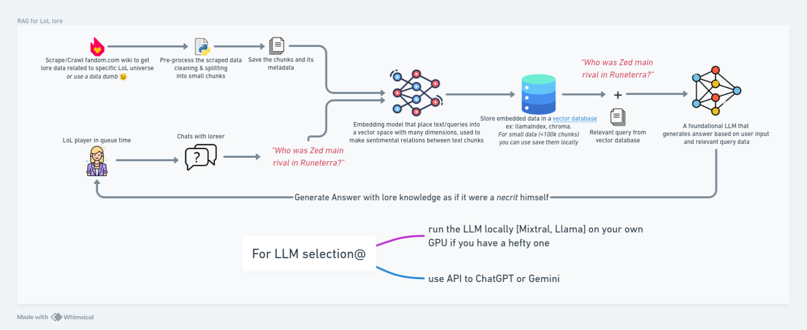

# Loreer (WIB)


Loreer is a sophisticated AI assistant designed to provide comprehensive knowledge on various lores, including movies, series, games, and books. Powered by advanced Large Language Models (LLMs) and AI, Loreer utilizes a Retrieval-Augmented Generation (RAG) system to deliver precise and relevant information.
This RAG system is built upon [League of Legends (LoL)](https://www.leagueoflegends.com/en-us/) lore and can precisely answer any LoL lore related questions.

Below is a high-level overview of the system.

###### [link to whiteboard](https://whimsical.com/loreer-design-DQbf9fQs6HfMCJRimPsLon)

 ## Features

- Comprehensive lore knowledge
- Powered by advanced LLMs and AI
- Efficient data processing and embedding
- Local RAG system integration

## Repo Structure

| Name | Objective | Path |
|----------|----------|----------|
| 00-parse_xml_dumb.ipynb | parses the XML file and removes unnecessary pages | [Link](./00-parse_xml_dumb.ipynb) |
| 01-preprocess_data.ipynb | clean the data and split it into chunks | [Link](./01-preprocess_data.ipynb) |
| 02-embed_chunks.ipynb | Embedd the chunks into a vector embedding for fast retrival | [Link](./02-embed_chunks.ipynb) |
| 03-pure_LLM.ipynb | running a quantized Llama-3-8b locally using llama.cpp | [Link](./03-pure_LLM.ipynb) |
| 04-RAG_system.ipynb | Integerate the embedded query and the LLM into a single prompt | [Link](./04-RAG_system.ipynb) |
| web_app.py | A streamlit web app that utilize RAG system backend | [Link](./web_app.py) |

## Web App
A web app using [Streamlit](https://streamlit.io/) is build as a UI. To run the web app simply run the below command.

```bash
streamlit run web_app.py
```
    
## Models and data
#### Models:

In RAG system there can be lots of models, for this repo the used models are:

| Name | Objective | link |
|----------|----------|----------|
| meta-llama-3-8b-instruct.Q4_K_M.gguf | A quantized LLM Llama 3 8b model with GGUF format for llama.cpp usage  | [HF](https://huggingface.co/SanctumAI/Meta-Llama-3-8B-Instruct-GGUF/tree/main) |
| Alibaba-NLP/gte-base-en-v1.5 | An embedding model that support the context length of up to 8192 ranks high on [MTEB](https://huggingface.co/spaces/mteb/leaderboard)  | [HF](https://huggingface.co/Alibaba-NLP/gte-base-en-v1.5) |

#### Data:
For data, The [LoL Wiki](https://leagueoflegends.fandom.com/wiki/League_of_Legends_Wiki) has an [offical data dump](https://leagueoflegends.fandom.com/wiki/Special:Statistics) that was parsed, cleaned, and embedded into a vector database.

All links to download the models and the data are available in the repo.

## Reproducibility 
The repository's code serves as a strong foundation for the potential extension of this RAG system to encompass different Wiki/fandom domains.

## Hardware requirments
I managed to run the quantized llama3 on a laptop with 16GB of ram and a rtx 3060 with 6GB of vram, while it takes about 2-10 seconds to answer a query on the whole RAG pipeline [Retrieval, information extraction and summarization, prompt answering], it is astonishing just how much you can get on mid tier laptop.

## References

- https://developer.nvidia.com/blog/rag-101-demystifying-retrieval-augmented-generation-pipelines/
- https://www.youtube.com/watch?v=u5Vcrwpzoz8&t=11s
- https://www.youtube.com/watch?v=qN_2fnOPY-M&t=1s
- https://vickiboykis.com/what_are_embeddings/
- https://huggingface.co/spaces/mteb/leaderboard Massive Text Embedding Benchmark (MTEB) Leaderboard
- https://www.pinecone.io/learn/chunking-strategies/
- https://python.langchain.com/v0.1/docs/modules/data_connection/document_transformers/
- https://learn.microsoft.com/en-us/ai/playbook/technology-guidance/generative-ai/working-with-llms/prompt-engineering
- for big documents https://en.wikipedia.org/wiki/Vector_database
- https://www.mixedbread.ai/blog/mxbai-rerank-v1
- https://huggingface.co/TheBloke for quantized models
- https://huggingface.co/spaces/open-llm-leaderboard/open_llm_leaderboard
- https://www.promptingguide.ai/ *&* https://www.promptingguide.ai/introduction/examples
- https://github.com/brexhq/prompt-engineering
- https://arxiv.org/abs/2401.14423
- https://www.anthropic.com/news/prompt-engineering-for-business-performance
- https://huyenchip.com/2024/01/16/sampling.html
- https://www.llamaindex.ai/blog/evaluating-the-ideal-chunk-size-for-a-rag-system-using-llamaindex-6207e5d3fec5
 
## License

This project is licensed under the MIT License.
